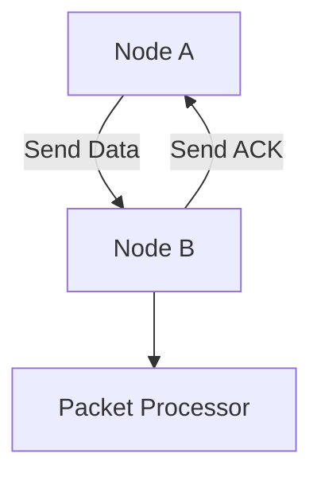

# Packet Transmission Simulation

A C++ simulation of reliable packet transmission between network nodes with error handling and retransmission mechanisms.

## 📌 Overview

Simulates a basic communication protocol between two nodes with:
- Packet loss simulation (10% probability)
- Packet corruption simulation (5% probability)
- Automatic retransmission (up to 3 attempts)
- Multithreaded packet processing
- ACK/NACK acknowledgment system

## 🚀 Features

| Feature | Description |
|---------|-------------|
| **Reliable Transmission** | Guarantees packet delivery with retransmission |
| **Error Simulation** | Configurable packet loss and corruption rates |
| **Multithreading** | Concurrent packet processing using threads |
| **Sequence Tracking** | Maintains packet order with sequence numbers |
| **ACK Mechanism** | Proper acknowledgment of received packets |

## 📋 Example Output

```plaintext
Node A is sending DATA packet: Test (Seq: 1) to Node B (Attempt 1)
Node B received DATA packet: Test (Seq: 1)
Node B is sending ACK packet: ACK (Seq: 1) to Node A (Attempt 1)
Node B is processing packet: Test (Seq: 1)
Node A received ACK packet: ACK (Seq: 1)
Node A is sending DATA packet: Packet (Seq: 2) to Node B (Attempt 1)
Node B received DATA packet: Packet (Seq: 2)
Node B is sending ACK packet: ACK (Seq: 2) to Node A (Attempt 1)
Node B is processing packet: Packet (Seq: 2)
Node A received ACK packet: ACK (Seq: 2)
Node B is stopping packet processing.
```
## 🏗️ System Architecture


### Key Components:
1. **Node Class**: Represents each communication endpoint.
   - Sends and receives packets.
   - Handles packet loss, corruption, and retries.
   - Processes incoming packets.

2. **Packet Class**: Represents a data packet.
   - Contains packet type (DATA or ACK), data, and sequence number.

3. **Main Program**: Initializes two nodes, simulates the sending and receiving of packets, and handles errors or retries if necessary.

---

## Classes and Methods

### Node Class
The `Node` class is responsible for sending and receiving packets between two nodes.

#### Methods:
- **send(const Packet &packet, Node &receiver)**: Sends a packet to another node. Retries up to 3 times if the transmission fails.
- **receive(const Packet &packet, Node &sender)**: Receives a packet, simulates packet loss or corruption, and processes it.
- **processPackets()**: Processes received packets, handling them as needed.
- **stop()**: Stops packet processing for the node.

### Packet Class
The `Packet` class represents a packet that is transmitted between nodes.

#### Attributes:
- `data`: The content of the packet.
- `sequenceNumber`: A unique identifier for each packet.
- `type`: The type of packet (DATA or ACK).

---

## Error Handling

The simulation includes error handling for the following scenarios:
- **Packet Loss**: A random probability (10%) is introduced to simulate packet loss during transmission.
- **Packet Corruption**: A random probability (5%) is used to simulate packet corruption.
- **Transmission Failure**: If a packet fails to be sent after 3 retries, an error message is displayed.

---

## Main Program Flow

1. **Initialization**: The main program initializes two nodes, `nodeA` and `nodeB`, each associated with a random number generator.
2. **Packet Creation**: Two packets (`packet1` and `packet2`) are created with sequence numbers and data.
3. **Sending Packets**: `nodeA` sends the packets to `nodeB`. Each packet is sent with retries if necessary.
4. **Packet Processing**: `nodeB` processes the received packets and sends acknowledgment packets back to `nodeA` upon successful receipt of data packets.
5. **Termination**: After processing the packets, `nodeB` stops its packet processing and the program terminates.

---

## 🛠️ Installation and Setup

To run the simulation, follow these steps:

```sh
g++ main.cpp -o packet_transmission -std=c++11 -pthread
```
```sh
./packet_transmission
```

## 📚 Node Class Documentation

The `Node` class provides essential methods for handling network packet transmission and processing.

## 📌 Methods

| Method             | Description |
|-------------------|------------------------------------------------|
| `send()`         | Transmits a packet with built-in retry logic to ensure successful delivery. |
| `receive()`      | Handles incoming packets and prepares them for processing. |
| `processPackets()` | Processes received data and performs necessary operations. |
| `stop()`         | Terminates packet processing, shutting down the node safely. |

## 📘 Additional Notes
- **`send()`**: Implements a retry mechanism to handle transmission failures.
- **`receive()`**: Ensures that incoming data is correctly processed before forwarding.
- **`processPackets()`**: May involve parsing, validation, or further data handling.
- **`stop()`**: Gracefully stops all packet-related activities.

## 🔧 Usage Example
```python
node = Node()
node.send()
node.receive()
node.processPackets()
node.stop()
```

